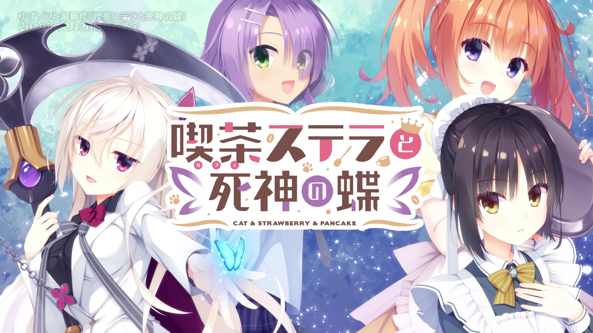
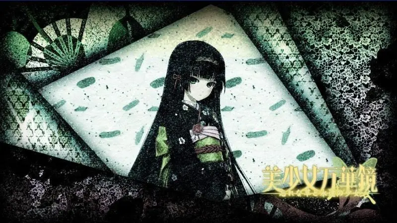
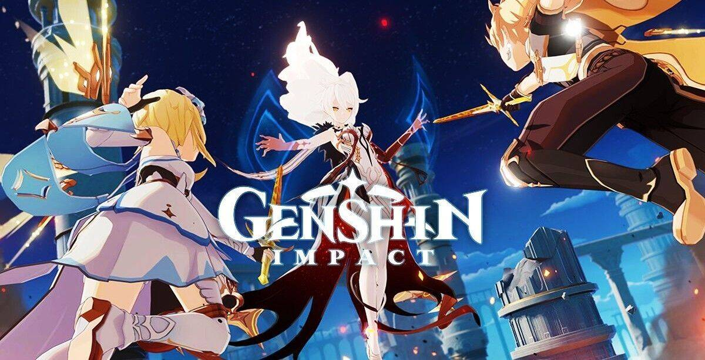
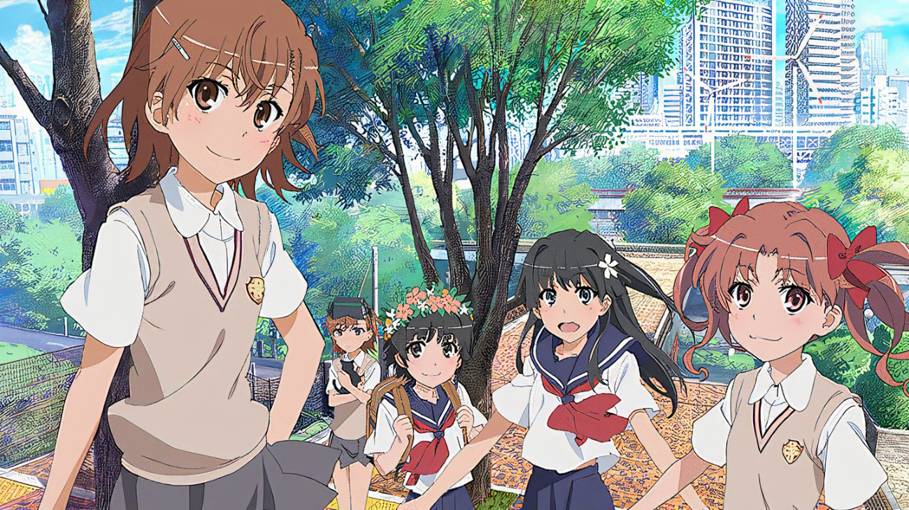

<h1 id="Title">Stella TTS Based on VITS</h1>

<h2 id="Contents">Contents</h2>

- [Introduction](#Introduction)
- [MoeGoe](#MoeGoe)
- [Models](#Models)
  - [Café Stella and the Reaper's Butterflies](#Stella)
  - [Yosuga No Sora](#Yosuga)
  - [Genshin](#Genshin)
  - [Bishojo Mangekyo](#Mangekyo)
  - [A Certain Scientific Railgun](#Railgun)
- [Contact](#Contact)
- [References](#References)

<h2 id="Introduction">Introduction</h2>

Just have some fun...

<h2 id="MoeGoe">MoeGoe</h2>

You can run my models on [MoeGoe](https://github.com/CjangCjengh/MoeGoe) developed by [CjangCjengh](https://github.com/CjangCjengh)! Please first read the instructions of MoeGoe
and then download my models and corresponding configuration files.

<h2 id="Models">Models</h2>

---

<h3 id="Stella">Café Stella and the Reaper's Butterflies</h3>

- Characters

 |Name|ID|
 |-|-|
 |四季ナツメ|0|
 |明月栞那|1|
 |墨染希|2|
 |火打谷愛衣|3|
 |汐山涼音|4|

- Model: 
  - [Google Drive (380 epochs)](https://drive.google.com/file/d/15lw7aIqvD1OmFPlynGm1NZN3BrhkY6YP/view?usp=sharing)
  - [百度网盘 (198 epochs) 提取码0721](https://pan.baidu.com/s/1jfJ5vH9KNzZu10ualhNHjQ)

- Configuration file: 
  - [Google Drive](https://drive.google.com/file/d/18ly18hVT8jvgyKbLl7qqqBAaV7Fwkrp5/view?usp=sharing)
  - [百度网盘 提取码0721](https://pan.baidu.com/s/1uxP5vGBeNwd4UpPLkQnimA)

- Demo
  - Colab: [VITS (星光咖啡馆)](https://colab.research.google.com/drive/1nKa-l15f_talGvIwPmKTLYwwaE1Mztjg?usp=sharing)

  - BILIBLI: [基于VITS的星光咖啡馆5人语音合成模型](https://www.bilibili.com/video/BV1ra411P7CA?share_source=copy_web&vd_source=630b87174c967a898cae3765fba3bfa8)

---

<h3 id="Yosuga">Yosuga No Sora (training...)</h3>

- Characters

|Name|ID|
|-|-|
|春日野穹|0|
|天女目瑛|1|
|依媛奈緒|2|
|渚一葉|3|
|春日野悠 (reserved)|4|

- Model: 
  - [Google Drive ((400+ epochs))](https://drive.google.com/file/d/1eWe-G8trLiX7aRrOyud_ywNlVPRzR2wK/view?usp=sharing)

- Configuration file: 
  - [Google Drive](https://drive.google.com/file/d/1-oE8i4gI-S_go9-JkSOhg_Ix7ZP5qimp/view?usp=sharing)

- Demo
  - Colab: [VITS (缘之空)](https://colab.research.google.com/drive/1FeuXBF_XXjYiEI11Y9UQW7YBfUZFJZbc?usp=sharing)

---

<h3 id="Mangekyo">Bishojo Mangekyo (training...)</h3>

- Description

|Name|ID|
|-|-|
|蓮華|0|
|篝ノ霧枝|1|
|沢渡雫|2|
|亜璃子|3|
|灯露椎|4|
|覡夕莉|5|

- Model:

- Configuration file:

- Demo

---

<h3 id="Genshin">Genshin (debugging...)</h3>

- Description

TTS of 46 characters of Genshin will be supported!

- Model: 

- Configuration file: 

- Demo

---

<h3 id="Railgun">A Certain Scientific Railgun (collecting data...)</h3>

- Characters

|Name|ID|Name|ID|
|-|-|-|-|
|上条当麻|0|削板軍覇|7|
|一方通行|1|御坂妹|8|
|垣根帝督|2|最終信号|9|
|御坂美琴|3|白井黒子|10|
|麦野沈利|4|佐天涙子|11|
|食蜂操祈|5|飾利初春|12|
|正体不明|6|インデックス|13|

- Model: 

- Configuration file: 

- Demo

<h2 id="Contact">Contact</h3>

QQ: 2235306122

BILIBILI: [Francis_Komizu](https://space.bilibili.com/636704927)

<h2 id="References">References</h3>

[Original code](https://github.com/jaywalnut310/vits)

[Reference code](https://github.com/CjangCjengh/vits)
